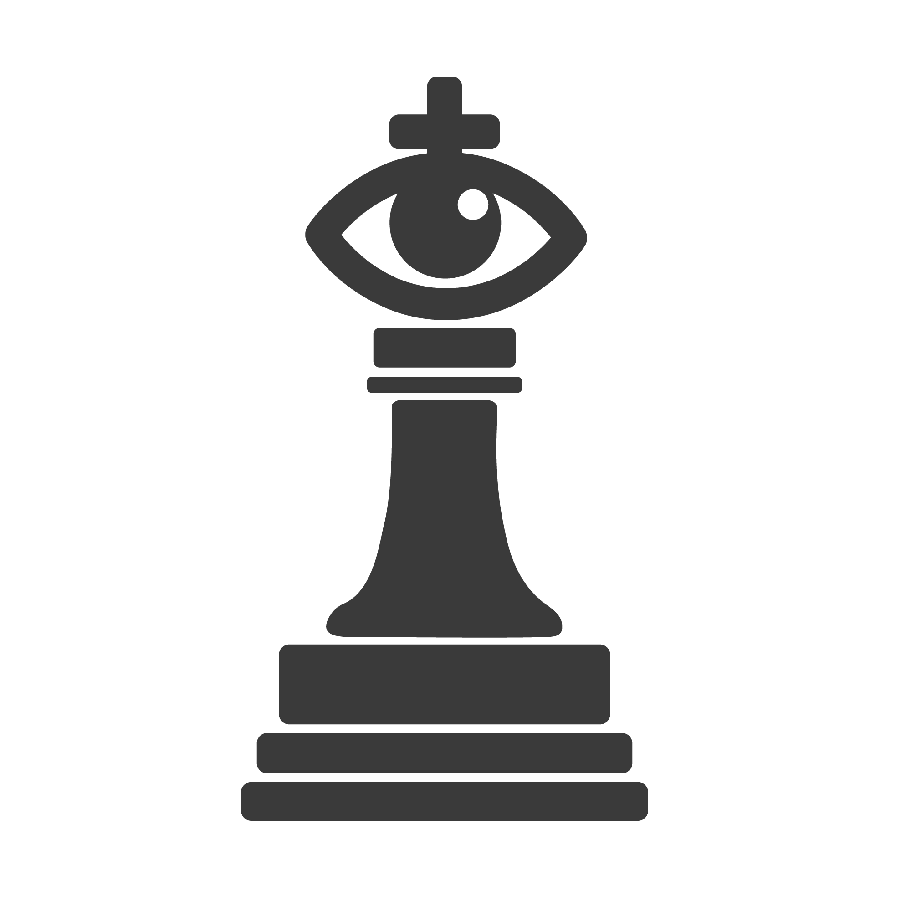

<h1 align="center">
  <br>
  
  <br>
  Chesster
  <br>
</h1>

<h2 align="center" style="margin:-10px;">From Screenshot to Chessboard</h2>
<h4 align="center">A .NET Core library with functionality to take a simple screenshot of a chessboard to a fully-evaluated position.</h4>

<p align="center">
  <a href="https://travis-ci.com/YilianSource/chesster">
    
  </a>
</p>

<!--<p align="center">
  <a href="#features">Features</a> •
</p>-->

---

## Main Features

- Chessboard extraction from an input image
- Position recognition using a neural network
- Orientation prediction of the board (black- or white-perspective) using a neural network
- Evaluation and move recommendation using the [Stockfish engine](https://github.com/official-stockfish/Stockfish)

## Installing

The source code can be cloned via GitHub. A NuGet package is planned for the future.

Pre-trained models for the utilized networks can be downloaded from the [releases](https://github.com/YilianSource/chesster/releases). To allow Chesster to find the models, they will have to be placed inside an `asset/` folder in the build folder. Chesster will automatically generate that folder when built, and is also the location where it stores source images and training data.

## Documentation

The full docs can be found [here](https://yiliansource.github.io/chesster/)!

Predicting a board from an input image is as easy as calling:

```cs
Board board = BoardVision.PredictBoard(imagePath);
```

From there the position can be evaluated as follows:

```cs
Evaluation evaluation = Evaluator.EvaluateWhite<StockfishEngine>(board);
```

Since it cannot be inferred which player's move it is from the image, the user will have manually evaluate both sides potentially.

## Examples

Examples are being worked on! Stay tuned!